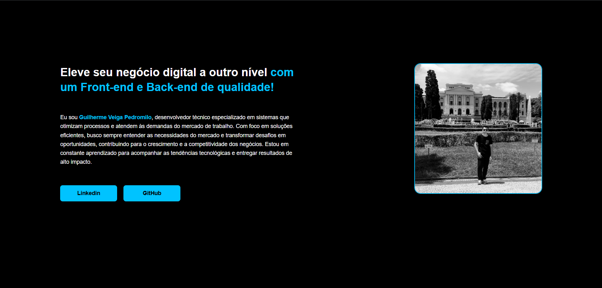
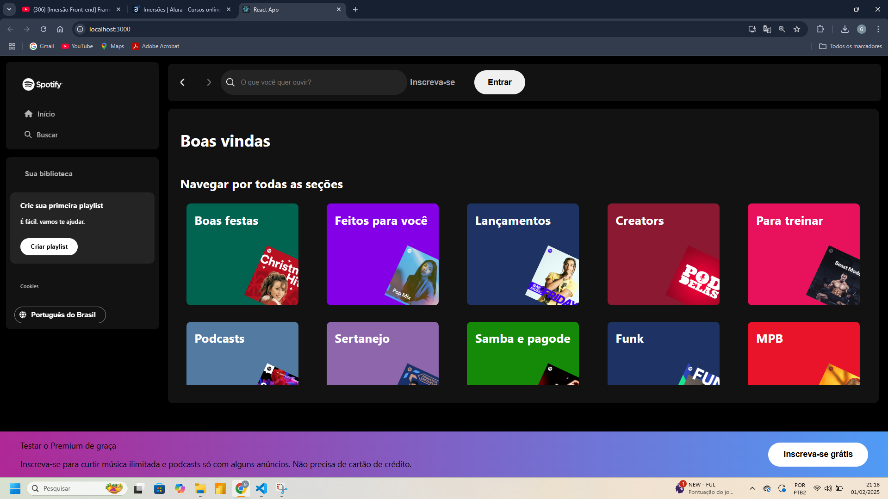

# Imersão Alura Front-end 2ª edição

---

## Portfólio criado

---

## Página Spotify em React.js

---

## Sites auxiliáres

- [Roda de cores e paleta Adobe Color](https://color.adobe.com/pt/create/color-wheel);
- [Coolors](https://coolors.co/);
- [Extensões mais usadas no VScode](https://www.alura.com.br/artigos/extensoes-vs-code-descubra-as-mais-usadas);
- [Font Awesome](https://fontawesome.com/);

---
## Documentações

- [HTML](https://www.w3schools.com/Html/html_intro.asp);
- [Tags semânticas no HTML](https://developer.mozilla.org/pt-BR/docs/Glossary/Semantics);
- [CSS](https://www.w3schools.com/css/);